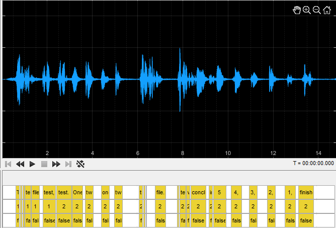
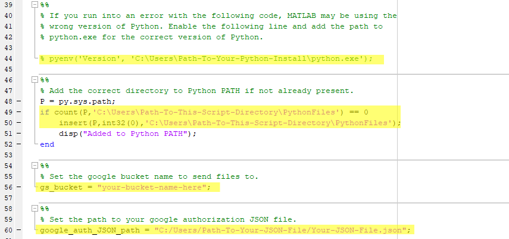

# MATLAB-Audio-Labeler-Google-Cloud-Speech-to-Text-LongRunningRecognize-with-Python
<p align="center">
  
</p>
My attempt at fixing the MATLAB Audio Labeler app's Speech-to-Text function's issues with regards to using Google's cloud-based speech-to-text service. This program leverages Python to automatically upload and run long_running_recognize on compatible audio files. No more error messages from Audio Labeler's built-in Speech-to-Text function that your audio recording is too long.

Originally intended to trancribe files for grading of speech accuracy.
Includes labels for speakers and accuracy (can be ignored if not wanted).

### This program may require an understanding of Python. It certainly wouldn't hurt.

## How It Works
1. MATLAB and its easy uigetfile function are used to allow the user to select their audio file.
2. The file is remixed to a mono .wav file if it's not already.
3. The file and necessary inforation are then passed to the Python script that uploads the file to a Google Cloud Storage bucket, performs the transcription, and passes back the results.
4. MATLAB then turns the results into a table of words with start and end times, and then further into a Labeled Signal Set (lss) linked to the audio file.
5. MATLAB then saves both the table and the lss before opening Audio Labeler and prompting the user to load the Labeled Signal Set either from the saved file or from the workspace.

## Setup
Before you use this program, there are a number of steps required to get everything up and working.
1. Download and extract the repository.
2. If you want more organized documentation of the MATLAB script, unzip the html folder and view the .html document.
3. Install [Python](https://www.python.org/downloads/).
4. Run the MATLAB_Speech_Recog_SETUP.py file. It should be under /PythonFiles. The script should end with this message: "Looks like everything works as intended! You're ready to begin!". If so, you can skip the next step. If not, try the next step before going further.
5. Double check that you have successfully installed the google-cloud-speech and google-cloud-storage libraries by entering the commands below into your terminal. If this all works without error, you're good to proceed. If not, then you may have to [manually install](https://cloud.google.com/speech-to-text/docs/libraries) the google-cloud-speech and google-cloud-storage libraries.
```python
python
>>> from google.cloud import speech
>>> from google.cloud import storage
```
6. Set up your [Google Cloud Speech-to-Text API](https://cloud.google.com/speech-to-text/docs/quickstart-client-libraries).
7. Download your [Google Cloud authorization JSON file](https://cloud.google.com/speech-to-text/docs/libraries) and store it someplace safe. We recommend the /data folder in /PythonFiles.
8. Create a [Google Cloud Storage bucket](https://cloud.google.com/storage/docs/creating-buckets) to store your audio files.
9. Create a folder in your Google Cloud Storage bucket named __TranscriptionOutput__.
10. Change the paths for your download of the Python script folder. (Lines 49 and 50 in the GoogleSpeech2TextPipeline.m file. See image below for highlighted lines.)
```MATLAB
49. if count(P, 'C:\Users\Path-To-This-Script-Directory\PythonFiles') == 0
50.     insert(P, int32(0), 'C:\Users\Path-To-This-Script-Directory\PythonFiles');
```
11. Change the path to your Google Cloud authorization JSON file. (Line 60 in the GoogleSpeech2TextPipeline.m file.  See image below for highlighted lines.)
```MATLAB
60. google_auth_JSON_path = "C:/Users/Path-To-Your-JSON-File/Your-JSON-File.json";
```
12. Change the name of the bucket to the name of your Google Cloud Storage bucket. (Line 56 in the GoogleSpeech2TextPipeline.m file.  See image below for highlighted lines.) *Bucket names are unique identifiers, so make sure to use **just** the name of the bucket. **NOT** gs://your_bucket_name. **JUST** your_bucket_name.*
```MATLAB
56. gs_bucket = "your-bucket-name-here";
```
13. (Optional) If you have more than one version of Python installed (as I did when developing this) MATLAB may use the wrong version and the script might break. You can change line 44 to the installation path to the correct version of Python and enable the line to fix this.
```MATLAB
44. % pyenv('Version', 'C:\Users\Path-To-Your-Python-Install\python.exe');
```

<p align="center">
  
  <br/>Lines in GoogleSpeech2TextPipeline.m to change for your installation.
</p>

Once all of that is complete, you should be ready to fire up MATLAB and run GoogleSpeech2TextPipeline.m. If you've set up everything correctly, it should work!

## Running
1. Load up the GoogleSpeech2TextPipeline.m file in MATLAB.
2. Decide a few things:
* Do you want to save the uploaded audio file to the bucket? (By default, the script uploads the audio only for transcription and removes it from the bucket as soon as transcription is done.)
  - If so, disable the following lines (lines 160 & 161 in the original upload):
  ```MATLAB
  160. disp("Deleting file from Google Cloud bucket...");
  161. py.MATLAB_Speech_Recog.delete_blob(gs_bucket, destination_blob_name, google_auth_JSON_path);
  ```
* How many speakers (i.e. people) do you want Google to attempt to differentiate between (Speaker diarization)?
  - Set the number in quotes (the second to last input in the function) in the follwing line (line 155 in the original upload) to the WHOLE NUMBER INTEGER (duh) of people you want Google to look for.
  ```MATLAB
  155. result = py.MATLAB_Speech_Recog.transcribe_gcs_multi(path_to_bucket_file, google_auth_JSON_path, "2", false);
  ```
* Do you want to save the transcription results to a .txt file in the bucket?
  - If so, set the last input in the function in the following line (line 155 in the original upload) from false to true.
  ```MATLAB
  155. result = py.MATLAB_Speech_Recog.transcribe_gcs_multi(path_to_bucket_file, google_auth_JSON_path, "2", false);
  ```
3. Run the script.
4. Select your audio file (either .wav or .mp3).
5. Wait for the script to upload your file, transcribe it, make the labeled signal set, and bring up Audio Labeler. For longer audio files this can take a while. Be patient.
6. Once Audio Labeler has loaded, go to Import -> From Workspace and choose the variable "lss". Alternatively, you can choose From File and load the saved variable from the Output folder of this program.
7. This should load both the audio file and the transcribed audio. For longer audio files this can take a while. Be patient.
8. If you want to view just the transcribed words and their (estimated) beginning and end, see the variable labeled "full_table_results".
9. Both the labeled signal set and the full table of results are named based on the original name of the audio file and saved to the Output folder of this program.

If you want to practice playing around with a labeled signal set in Audio Labeler, you can launch Audio Labeler and load the ExampleOutput.mat file from the Output folder of this program. Yes that is my voice. No making fun of my test file.

## See the html page in the html.zip folder for a gif example of loading and interacting with Audio Labeler.

## This program relies on the use of the Google Cloud Speech-to-Text API. Which is (sadly) not free. It also requires the Signal Processing and Communications toolbox for MATLAB. Ditto on the not free-ness.

I'm far from a professional programmer, so forgive me if this program has its bugs or issues.

## If you use my code to do something fun or cool, share it with me! Also, credit is nice to have too.
### Enjoy!
